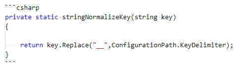

# 长沙.NET技术社区官网
本库为长沙.NET技术社区官网代码和内容

网址:<http://hn-tech.net/>

# 社区发帖指南

社区网站基于hexo进行搭建，内容托管在github，基于docker进行自动构建。在开始之前，您需要了解以下内容：

## 基本信息

社区官网：<http://hn-tech.net/>

代码库（**社区官网基于此库自动构建**）：<https://github.com/china-net-community/OfficialWebsite>

## 仅提交内容（发帖）

### 必备技能

技能|说明
---|:--
git|需要使用git提交内容，教程：<https://www.runoob.com/git/git-tutorial.html>
Markdown|需要使用Markdown语法编写内容，参考：<https://www.w3cschool.cn/markdownyfsm/>
pull request（以下简称pr）|需要提交pr，待管理员审核，参考：<https://help.github.com/cn/articles/creating-a-pull-request>

### 发帖目录说明

网站主要内容目录如下图所示：


主体目录如下：

目录|说明
---|:--
_posts|内容目录，也就是帖子目录，所有Markdown文件请按照目录分类进行提交
res|图片资源目录

帖子目录目前如下所示，具体要求请参考该分类下的说明：

目录|说明
---|:--
家务|
开源|社区开源库、开源计划说明
招聘|社区招聘内容
活动|社区活动内容

### 提交（发帖）流程

以下为社区发帖的初步流程：

1. 从<https://github.com/china-net-community>创建pr
2. 使用Visual Studio Code（推荐）添加或编辑相关的Markdown文档
3. 签入并推送内容
4. 通知管理员审核（@微信群、QQ群），由于大家都是兼职，请耐心等待
5. 审核通过后2~5分钟会自动更新内容

### 帖子顶部变量设置说明

参数|描述|默认值
---|:--:|:--
layout|	布局|
title	|文章标题，强烈建议填写此选项|
date	|发布时间，强烈建议填写此选项，且最好保证全局唯一	|
updated	|更新日期	|文件更新日期
comments	|开启文章的评论功能	|true
tags|	标签（不适用于分页）|
categories|	文章分类，本主题的分类表示宏观上大的分类，只建议一篇文章一个分类|
permalink	|覆盖文章网址|
author	|作者|
img | 列表封面图|
top| 推荐文章（文章是否置顶），如果 top 值为 true，则会作为首页推荐文章|false
cover| 表示该文章是否需要加入到首页轮播封面中 |false
coverImg | 表示该文章在首页轮播封面需要显示的图片路径，如果没有，则默认使用文章的特色图片|
password | 文章阅读密码，如果要对文章设置阅读验证密码的话，就可以设置 password 的值，该值必须是用 SHA256 加密后的密码，防止被他人识破。前提是在主题的 config.yml 中激活了 verifyPassword 选项 |
toc	| 是否开启 TOC，可以针对某篇文章单独关闭 TOC 的功能。前提是在主题的 config.yml 中激活了 toc 选项 | true
mathjax |是否开启数学公式支持 ，本文章是否开启 mathjax，且需要在主题的 _config.yml 文件中也需要开启才行 | false
summary | 文章摘要，自定义的文章摘要内容，如果这个属性有值，文章卡片摘要就显示这段文字，否则程序会自动截取文章的部分内容作为摘要 |

参考示例：

```yml
---
title: 社区发帖指南
author: 李文强
img: /res/20190702143924.png
top: true
cover: true
toc: true
mathjax: false
summary: 社区发帖指南，请严格按照要求进行发帖。
date: 2019-07-02 19:31:59
tags:
  - 发帖必读
categories:
  - 公告
---
```

### 其他

#### 如何设置代码高亮？

C#代码高亮设置如下所示：

```csharp
private static stringNormalizeKey(string key)
{

    return key.Replace("__",ConfigurationPath.KeyDelimiter);
}
```



支持的编程语言：


完整支持见：<https://prismjs.com/#supported-languages>

## 进阶内容（帮忙一起改网站）

### 要求

技能|说明|
---|:--:|
前端|hexo很灵活，主题内容均可修改。
hexo|hexo是一个快速、简洁且高效的博客框架，您如果需要参与社区网站建设，需要对hexo有一定的了解。hexo官网：<https://hexo.io/zh-cn/>
docker|使用docker进行构建，可选

### 主题说明

网站使用了hexo-theme-matery主题，具体见：
<https://github.com/blinkfox/hexo-theme-matery>
